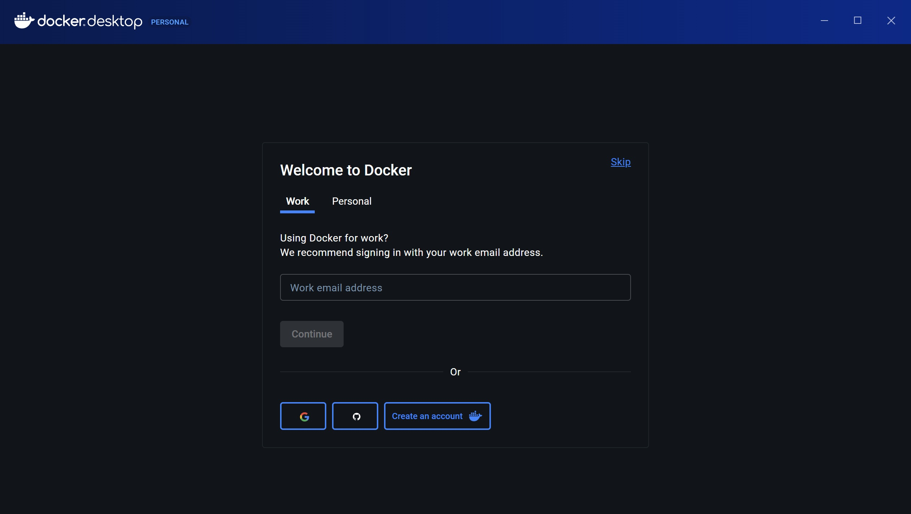
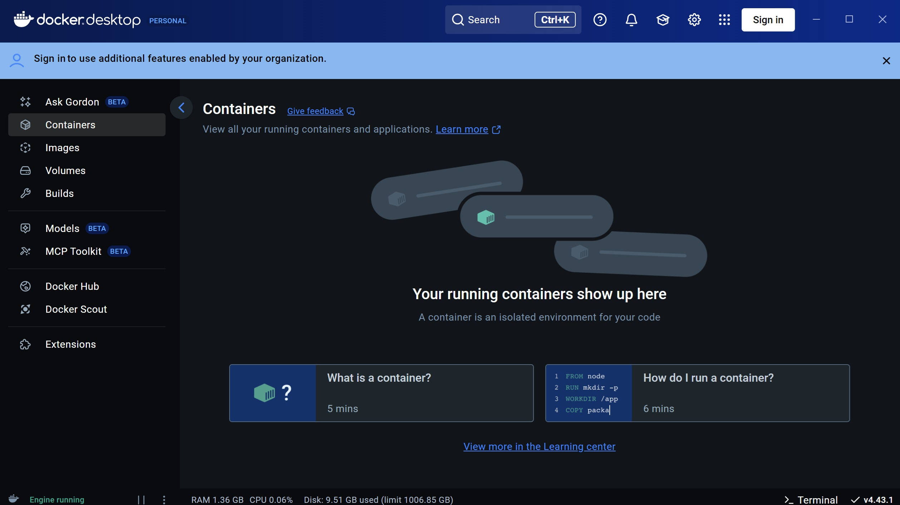
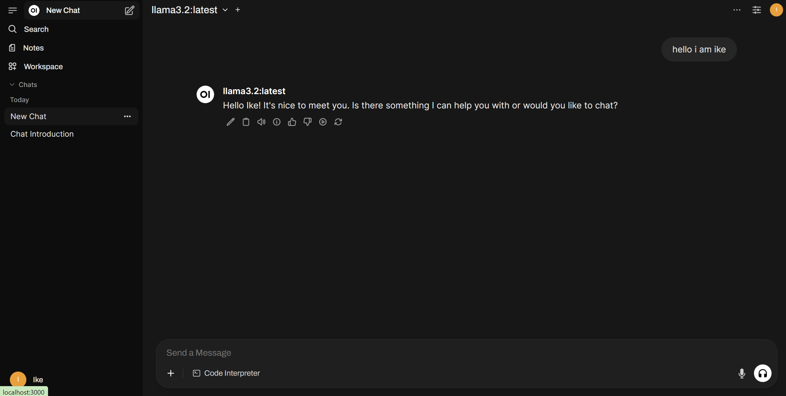

# Open WebUI with Python

Open WebUI is an extensible, feature-rich, and user-friendly self-hosted AI platform designed to operate entirely offline. It supports various LLM runners like Ollama and OpenAI-compatible APIs, with built-in inference engine for RAG, making it a powerful AI deployment solution.

This extensive guide will teach you how to install and run it on your **own PC step by step!**

## Software requirements
- Docker
- Python
- Ollama
- Any suitable LLM for your PC
- At least 8GB of RAM and 20GB of Storage

## Getting started

### 1. Docker Desktop
Docker is a tool that helps applications using containers. This is important to run Open WebUI.

This first step is only for **Windows OS**. Run the following command on your CLI. The `wsl` package is essenential for Docker to run but it is not built into Windows OS, unlike **Mac/Linux**.
```bash
wsl --install
```

After installation, run the following command to ensure you have the latest version.
```bash
wsl --update
```

This ensures the **Windows Subsystem for Linux (WSL)** is up-to-date as it is required for Docker Desktop to run correctly.

*NOTE: The following steps are now applicable for all OS*.

Download the latest version of **Docker Desktop** [here](https://www.docker.com/products/docker-desktop/).

Once you have Docker Desktop installed, you will be prompted to **Sign Up/Sign In**. You may choose to do so, or simply press **Skip** as shown below.



Once done, you may be prompted with some software updates and that is okay. Just follow the steps on-screen for Docker Desktop. Once Docker Desktop's updates and Windows Subsystem for Linux has been installed, you will see the following Docker Dashboard.



*NOTE: You may close this window but **DO NOT** end the **background process***
<hr/>

### 2. Python

Download the **latest version** of Python if you have not already [here](https://www.python.org/downloads/).

To check your current version, simply use this command:
```bash
py --version
```

This next step is **CRUCIAL** as Open WebUI only runs on **Python 3.11**.

```bash
winget install python.python.3.11
```

This installs Python 3.11 on your system, but as a **SECONDARY*** Python version. 

**Your default version will still be the one previously installed.*


<hr/>

### 3. Ollama

Ollama is a locally deployed AI model runner, designed to allow you to download and execute large language models (LLMs) directly on your PC.

Download the latest version [here](https://ollama.com/download).

After installing, launch Ollama. Note that will **NOT appear as a UI**, but simply a **background process**.

Run the following to check that ollama has been successfully installed on your system.
```bash
ollama --version
```

Next, find your Ollama LLMS [here](https://ollama.com/search). Ensure to get an LLM that is **BEST SUITED** for your own PC's **RAM Capacity**.

Let's use `deepseek-r1` with `8b` parameters for example.

```bash
ollama pull deepseek-r1 # to get the latest version of the LLM
```
Then run the following to get the `8b` model.
```bash
ollama run deepseek-r1:8b
```

*NOTE: This will take awhile depending on your internet and PC speed. Feel free to download as many models as you want as this can be used within Open WebUI!*

<hr/>

### 4. Open WebUI

Finally, after all the requirements, we can set up Open WebUI onto our system.

To install using **Python 3.11**, run the following command using `py -3.11 -m`. This might take awhile.
```bash
py -3.11 -m pip install open-webui
```

After installation, you can start Open WebUI by executing:
```bash
open-webui serve
```

Ensure that Docker Desktop is already running in the background. Then **open up a new CLI** and run the following:
```bash
docker run -d -p 3000:8080 --add-host=host.docker.internal:host-gateway -v open-webui:/app/backend/data --name open-webui --restart always ghcr.io/open-webui/open-webui:main
```

After installation, you can access Open WebUI at http://localhost:3000.



You have successfully set up **Open WebUI** on your own system! You can now play around with the different models you have on your system.

*NOTE: You may revisit Step 3 to download more Ollama models.*


## Important Reminders

- Keep your **Windows Subsystem for Linux** up-to-date by running `wsl --update` before every launch of Docker Desktop.
- Open WebUI can only run on **Python 3.11**, so ensure Step 2 is done properly.
- ONLY install LLMs that are **compatible with your own PC's RAM** or your system may crash and Open WebUI may not work as expected.
- Ensure that BOTH Docker Desktop and Ollama are **running in the background** before executing Step 4.
- Containers created (in Step 4) only need to be done **once**, do NOT run the same command as you will run into errors.

## Next steps

To close the Open WebUI local server, press `CTRL+C` or `CMD+C` in the CLI that you executed `open-webui serve`.

As the docker container has already been created, for future Open WebUI launches, simply execute `open-webui serve` on your CLI as the other steps have already been set up.


## Conclusion

This repo is a long an extensive guide to teach you how to completely set up Open WebUI on your system. If you have any questions, feel free to create an issue and I will get back to you as soon as possible.

Thank you!

